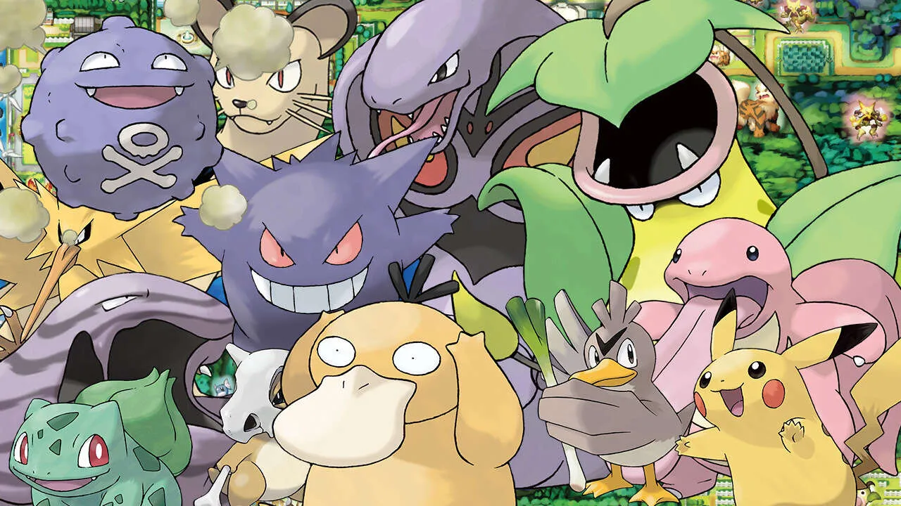

# Informatica - Classi Terze - Esercizio 5.1 - Console Applications

In questa esercitazione andremo a implementare un Pokédex basilare



> I dati dei pokémon sono forniti tramite vettori paralleli come variabili globali nel `Program.cs`

Si preveda la creazione di un programma che accetti un numero in input e restituisca le informazioni in base a un determinato comando:

- `1` -> Apri pokédex: Viene successivamente chiesto di scegliere un numero fra 1 e 151 e vengono mostrati i dati del rispettivo pokémon. Una volta mostrate le informazioni, premendo Invio torno al menù.
- `2` -> Cattura: Viene aperta una schermata di cattura per un pokémon a caso, si rimanda al capitolo dedicato per la spiegazione. Una volta terminato il tentativo di cattura, premendo Invio torno al menù.
- `3` -> Esci: Termina il programma

## Cattura di un pokémon

Prima di andare a catturare dei pokémon occorre partire dalle basi: servono delle pokéballs e all'utente ne vengono fornite 5
per ogni tentativo di cattura.

Ogni pokémon ha una resistenza alla cattura, che va da 1 a 100 (Più un pokémon è forte più è difficile catturarlo...).

Tirando una pokéball generiamo un numero da 5 a 100 che verrà sottratto alla resistenza del pokémon in questione. Se la resistenza va
a 0 o sotto 0 il pokémon è catturato. Se l'utente finisce le pokéballs il pokémon fugge.

La schermata di cattura mostra messaggi come il seguente:

```
Hai 5 pokéballs e decidi di andare a catturare qualche pokémon...
Appare un <nome-pokémon> selvatico!
```

A quel punto si apre un sotto-menù con 2 opzioni:

- `1` -> Tenta la cattura: L'utente lancia una pokéball e vengono mostrati i seguenti messaggi:
  ```
  Lanci una pokéball a <nome-pokémon>
  .
  ..
  ...
  ```
  se la cattura ha successo mostrare
  ```
  Evviva, <nome-pokémon> catturato con successo!
  ```
  altrimenti
  ```
  Oh no! Il <nome-pokémon> selvatico si è liberato!
  ```
  Se l'utente termina le pokéballs si stampa infine
  ```
  Il <nome-pokémon> selvatico è fuggito...
  ```
- `2` -> Fuggi: viene mostrato il messaggio
  
  `Scampato pericolo!` 
  
  e si attende che l'utente prema invio (cha fa tornare al menù).

## Esempi di esecuzione

Per motivi pratici, qui la simulazione mischia INPUT(`<`) e OUTPUT(`>`)

Ecco un esempio che mostra le funzionalità del pokédex
```
> Benvenuto, che cosa vuoi fare?
  1 - Consulta il pokédex
  2 - Vai a catturare qualche pokémon
  3 - Esci
< 1
> Inserisci il numero del pokémon di cui vuoi i dettagli
< 151
> Pokémon N° 151
  Mew
  Tipo: Psychic
  Immagine: http://www.serebii.net/pokemongo/pokemon/151.png
  Premi invio per continuare...
>
> Benvenuto, che cosa vuoi fare?
  1 - Consulta il pokédex
  2 - Vai a catturare qualche pokémon
  3 - Esci
< 1
> Inserisci il numero del pokémon di cui vuoi i dettagli
< 153
> Inserisci un numero fra 1 e 151
  Premi invio per continuare...
>
> Benvenuto, che cosa vuoi fare?
  1 - Consulta il pokédex
  2 - Vai a catturare qualche pokémon
  3 - Esci
< 1
> Inserisci il numero del pokémon di cui vuoi i dettagli
< 1
> Pokémon N° 001
  Bulbasaur
  Tipo: Grass, Poison
  Immagine: http://www.serebii.net/pokemongo/pokemon/001.png
  Premi invio per continuare...
> Benvenuto, che cosa vuoi fare?
  1 - Consulta il pokédex
  2 - Vai a catturare qualche pokémon
  3 - Esci
< 3
> Torna presto!
```

Ed ecco un altro esempio che mostra una cattura:

Ecco un esempio che mostra le funzionalità del pokédex
```
> Benvenuto, che cosa vuoi fare?
  1 - Consulta il pokédex
  2 - Vai a catturare qualche pokémon
  3 - Esci
< 2
> Hai 5 pokéballs e decidi di andare a catturare qualche pokémon...
  Appare un Rattata selvatico!
  Che vuoi fare?
  1 - Lancia Pokéball
  2 - Fuggi
< 1
> Lanci una pokéball al Rattata selvatico
  .
  ..
  ...
  Evviva, Rattata catturato con successo!
  Premi invio per continuare...
<
> Benvenuto, che cosa vuoi fare?
  1 - Consulta il pokédex
  2 - Vai a catturare qualche pokémon
  3 - Esci
< 2
> Hai 5 pokéballs e decidi di andare a catturare qualche pokémon...
  Appare un Mew selvatico!
  Che vuoi fare?
  1 - Lancia Pokéball
  2 - Fuggi
< 1
> Lanci una pokéball al Mew selvatico
  .
  ..
  ...
  Oh no! Il Mew selvatico si è liberato!
  Che vuoi fare?
  1 - Lancia Pokéball
  2 - Fuggi
< 1
> Lanci una pokéball al Mew selvatico
  .
  ..
  ...
  Oh no! Il Mew selvatico si è liberato!
  Che vuoi fare?
  1 - Lancia Pokéball
  2 - Fuggi
< 1
> Lanci una pokéball al Mew selvatico
  .
  ..
  ...
  Oh no! Il Mew selvatico si è liberato!
  Che vuoi fare?
  1 - Lancia Pokéball
  2 - Fuggi
< 1
> Lanci una pokéball al Mew selvatico
  .
  ..
  ...
  Oh no! Il Mew selvatico si è liberato!
  Che vuoi fare?
  1 - Lancia Pokéball
  2 - Fuggi
< 1
> Lanci una pokéball al Mew selvatico
  .
  ..
  ...
  Oh no! Il Mew selvatico si è liberato!
  Il Mew selvatico è fuggito.
  Premi invio per continuare...
<
> Benvenuto, che cosa vuoi fare?
  1 - Consulta il pokédex
  2 - Vai a catturare qualche pokémon
  3 - Esci
< 3
> Torna presto!
```

Infine un ultimo esempio su una cattura con fuga

```
> Benvenuto, che cosa vuoi fare?
  1 - Consulta il pokédex
  2 - Vai a catturare qualche pokémon
  3 - Esci
< 2
> Hai 5 pokéballs e decidi di andare a catturare qualche pokémon...
  Appare un Rattata selvatico!
  Che vuoi fare?
  1 - Lancia Pokéball
  2 - Fuggi
< 2
> Scampato pericolo!
  Premi invio per continuare...
<
> Benvenuto, che cosa vuoi fare?
  1 - Consulta il pokédex
  2 - Vai a catturare qualche pokémon
  3 - Esci
< 3
> Torna presto!
```